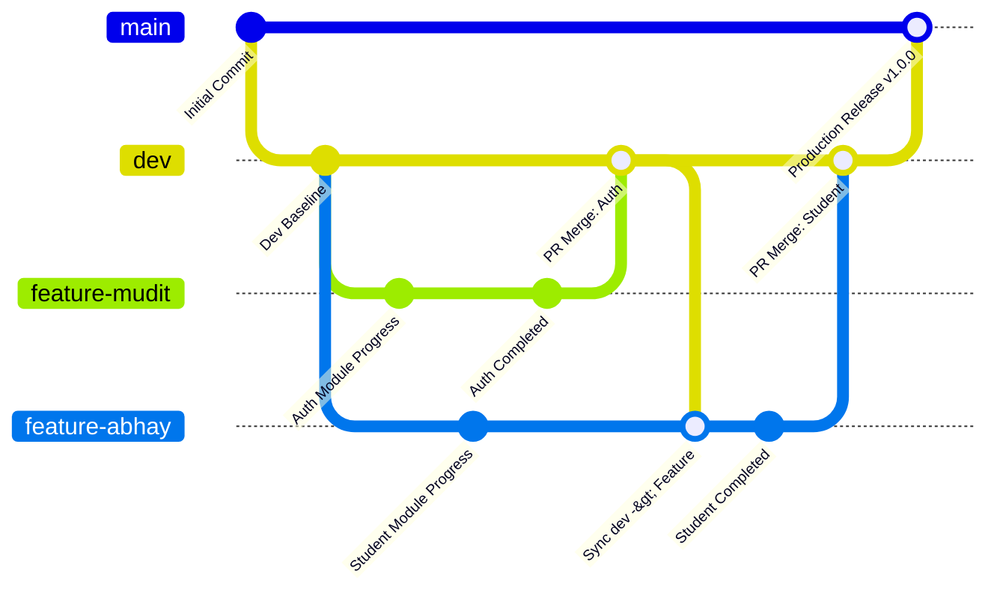

# LMS Edudigi - Enterprise Git Workflow & Collaboration Guide

Welcome to the **LMS Edudigi** ASP.NET Core project repository! To ensure code quality, smooth integration, and seamless collaboration among our 3-5 developers, we follow a professional, enterprise-grade Git branching workflow.

This guide outlines our Git architecture, branch naming conventions, standard developer operations, branch protection rules, and module-specific collaboration practices.

---

## Table of Contents
1. [Git Branching Architecture](#1-git-branching-architecture)
2. [Branch Naming Conventions](#2-branch-naming-conventions)
3. [Developer Git Cheat Sheet (Step-by-Step Commands)](#3-developer-git-cheat-sheet-step-by-step-commands)
4. [Pull Request (PR) & Code Review Process](#4-pull-request-pr--code-review-process)
5. [Merge Strategy Guide](#5-merge-strategy-guide)
6. [GitHub Branch Protection Setup](#6-github-branch-protection-setup)
7. [Enterprise Best Practices for 3-5 Developers](#7-enterprise-best-practices-for-3-5-developers)
8. [Entity Framework Core Migration Best Practices](#8-entity-framework-core-migration-best-practices)

---

## 1. Git Branching Architecture

We utilize an adapted **GitFlow / Feature Branching** model. Our branching taxonomy consists of two long-running branches (`main` and `dev`) and short-lived feature/fix branches.



### The Branch Hierarchy

| Branch | Classification | Access Control | Purpose / Lifecycle |
| :--- | :--- | :--- | :--- |
| `main` | Production / Stable | **Protected** (No direct commits) | Represents production-ready, stable code. Only updated via PR merges from `dev` during scheduled releases. |
| `dev` | Integration / Testing | **Protected** (No direct commits) | Active integration branch. All developers merge their feature branches here. Automated tests and QA validation are performed on this branch. |
| `feature/*` | Development (Temp) | Owner Only | Created off `dev` for active development on a specific module or user story. Deleted after successful merge into `dev`. |
| `bugfix/*` | Development (Temp) | Developer | Created off `dev` to resolve non-production bugs found during integration testing. |
| `hotfix/*` | Critical Fix (Temp) | Team Lead / Hotfix Dev | Created off `main` to address critical production issues. Merged into both `main` and `dev` immediately. |

---

## 2. Branch Naming Conventions

Consistency in branch naming enables automated CI/CD triggers and makes the repository readable. Use the following structured prefix patterns:

```
[category]/[ticket-id-or-name]-[short-description]
```

* **Features**: `feature/[dev-name]-[module-or-short-desc]` or `feature/[ticket-id]-[short-desc]`
  * *Example:* `feature/mudit-auth` or `feature/abhay-student-dashboard`
* **Bug Fixes**: `bugfix/[dev-name]-[short-desc]`
  * *Example:* `bugfix/ui-button-alignment`
* **Hotfixes (Production)**: `hotfix/[version]-[short-desc]`
  * *Example:* `hotfix/v1.0.1-login-crash`

---

## 3. Developer Git Cheat Sheet (Step-by-Step Commands)

Here are the complete Git commands for everyday development.

### A. Initial Setup & Cloning

If you are setting up the repository on a new machine for the first time:

```bash
# 1. Clone the repository
git clone https://github.com/VagminePro-Techno-Pvt-Ltd/LMS-Edudigi.git
cd LMS-Edudigi

# 2. Verify remote configuration
git remote -v

# 3. Pull latest main branch
git checkout main
git pull origin main

# 4. Track dev branch
git checkout dev
git pull origin dev
```

### B. Creating a Feature Branch & Working

Always start a feature by checking out a clean copy of the `dev` branch:

```bash
# 1. Ensure you have the latest dev updates
git checkout dev
git pull origin dev

# 2. Create and switch to your feature branch
git checkout -b feature/mudit-authentication

# 3. Work on your feature (e.g., in VS 2022). Keep commits frequent and atomic.
# Stage changed files
git add .

# Commit with a clear, descriptive message
git commit -m "feat(auth): add JWT token generation and user validation service"
```

### C. Pushing Code to GitHub

```bash
# Push feature branch to remote (creates upstream tracker on first push)
git push -u origin feature/mudit-authentication
```

### D. Keeping Feature Branch Synced with `dev`

To prevent massive merge conflicts at the end of a sprint, sync your feature branch with `dev` daily:

```bash
# 1. Fetch latest changes from remote
git fetch origin

# 2. Merge dev changes into your local feature branch
git checkout feature/mudit-authentication
git merge origin/dev

# 3. Resolve any conflicts locally, then test your project
# 4. Push synced changes back to your remote feature branch
git push origin feature/mudit-authentication
```

### E. Merging Feature → `dev` (Via Pull Request)

**Never merge feature branches directly into `dev` locally.** Always push the feature branch to GitHub and open a **Pull Request**. 

Once the PR is approved:
1. Complete the Pull Request on GitHub (using **Squash and Merge**).
2. Clean up local and remote tracking branches:

```bash
# 1. Switch to dev branch locally
git checkout dev

# 2. Pull the newly merged dev changes
git pull origin dev

# 3. Delete the local feature branch (it is now safe to delete)
git branch -d feature/mudit-authentication

# 4. Prune deleted remote branches from your local list
git fetch --prune
```

### F. Merging `dev` → `main` (Release Cycle)

When a set of features are fully tested on `dev` and ready for production deployment:
1. Open a PR on GitHub from `dev` to `main`.
2. Ensure release notes are added.
3. Once approved, merge using **Merge Commit** to maintain the historical release milestone.

```bash
# Pull changes locally to sync
git checkout main
git pull origin main
```

---

## 4. Pull Request (PR) & Code Review Process

To maintain professional standards, every piece of code must be reviewed.

1. **Title and Description**: Give the PR a clear title (e.g., `feat(student): implement course enrollment logic`) and describe *what* was changed and *how* to test it.
2. **Reviewers**: Assign at least 1 or 2 teammates to review your PR.
3. **Self-Review**: Look at your own diff before requesting review. Remove any commented-out debug code, print statements, or unused directives.
4. **Approval**: A minimum of **1 approval** from another developer is required before merging.
5. **CI/CD Checks**: Ensure that the PR passes all build checks and unit tests.

---

## 5. Merge Strategy Guide

We configure GitHub to use distinct merge strategies depending on the branch context:

| Context | Recommended Strategy | Rationale |
| :--- | :--- | :--- |
| **Feature Branch → `dev`** | **Squash and Merge** | Combines all minor "work-in-progress" commits into a single clean commit on `dev`. Keeps the integration history readable and avoids clutter. |
| **`dev` → `main`** | **Create a Merge Commit** | Preserves the release boundary, documenting exactly when a set of features went to production. |
| **Hotfix → `main` & `dev`** | **Squash and Merge** | Keeps the critical patch self-contained as a single action. |

---

## 6. GitHub Branch Protection Setup

To enforce the above workflow, the Repository Administrator should apply these settings under **Settings > Branches > Branch protection rules** on GitHub:

### A. Rules for `main` (Production Branch)
* [x] **Enforce:** "Require a pull request before merging"
  * [x] **Enforce:** "Require approvals" (Set minimum approvals to `1` or `2`)
* [x] **Enforce:** "Require status checks to pass before merging" (Run build and test actions)
* [x] **Enforce:** "Require conversation resolution before merging" (All review threads must be resolved)
* [x] **Enforce:** "Restrict who can push to matching branches" (No direct pushes allowed, except admin override if necessary)

### B. Rules for `dev` (Integration Branch)
* [x] **Enforce:** "Require a pull request before merging"
  * [x] **Enforce:** "Require approvals" (Set to `1`)
* [x] **Enforce:** "Require conversation resolution before merging"
* [x] **Enforce:** "Require status checks to pass before merging" (Ensures `dev` builds successfully at all times)

---

## 7. Enterprise Best Practices for 3-5 Developers

When 5 developers work on different modules (LMS, Auth, Students, Courses, Dashboard) simultaneously, follow these collaboration patterns to avoid blocking each other:

### A. Separation of Concerns & Solution Folder Structure
Our solution `TMS.sln` is broken into separate layer projects. Ensure modules are decoupled by utilizing the **Repository Pattern** and **Dependency Injection**:
* **Authentication**: Isolated within `TMS.Common` (helpers, security, tokens) and Controller actions. Avoid cluttering shared layers with auth-specific overrides.
* **Student & Course Management**: Communicate via interfaces (`ICourseService`, `IStudentService`) rather than direct concrete dependencies. Use Domain models for data exchange.
* **Dashboard**: Primarily reads data from other modules. Use optimized database Views or DTOs (Data Transfer Objects) to display aggregated metrics without modifying the tables of the active modules.

### B. Use Feature Flags / AppSettings Configurations
If a developer's feature is only partially complete but needs to be checked into `dev` to integrate with other components, protect it using a feature flag:
```csharp
if (_configuration.GetValue<bool>("FeatureFlags:EnableNewDashboard"))
{
    // Load new dashboard components
}
```
This allows you to merge code early and frequently without disrupting other developers or shipping incomplete UI.

### C. Write Unit & Integration Tests
Ensure that changes in one module (e.g., Student Enrollment) do not silently break another (e.g., Course Capacity tracking). 
* Write unit tests for business logic in `TMS.Common` or Services.
* Run tests locally before opening a Pull Request: `dotnet test`.

---

## 8. Entity Framework Core Migration Best Practices

Database migrations are the #1 source of merge conflicts in multi-developer teams. Follow these rules strictly to keep migrations healthy:

1. **Keep Migrations Small & Frequent**: Do not batch multiple days of database changes into one migration. Add migrations immediately when you alter a model.
2. **Never Edit an Existing Migration File**: If you made a mistake in a local migration that hasn't been pushed to remote, rollback using `Remove-Migration` (or `dotnet ef migrations remove`). If the migration is already pushed, create a *new* corrective migration instead.
3. **Handling Migration Merge Conflicts**:
   If Developer A and Developer B both create a new migration off the same parent, they will experience a conflict in the `TMS.Repository/Migrations/TMSContextModelSnapshot.cs` and the migration design files when merging.
   * **Resolution Workflow**:
     1. Roll back your local migration: `dotnet ef database update [NameOfLastCommonMigration]`.
     2. Remove the migration: `dotnet ef migrations remove`.
     3. Pull the latest `dev` changes containing the other developer's migration.
     4. Re-apply your database migration: `dotnet ef migrations add [YourMigrationName]`.
     5. Update your local database: `dotnet ef database update`.
     6. Stage, commit, and push your branch. This guarantees your migration runs *after* theirs in a clean, linear history.

---

## 9. Resolving Merge Conflicts: Step-by-Step

If Git flags a conflict when you try to merge `dev` into your feature branch:

```bash
# 1. Fetch and pull latest dev
git checkout dev
git pull origin dev

# 2. Checkout your feature branch
git checkout feature/mudit-authentication

# 3. Start the merge process (this will report conflicts)
git merge dev
```

### Visualizing and Resolving the Conflict:
Open the conflicted files in **Visual Studio 2022** or **VS Code**. You will see conflict markers:

```csharp
<<<<<<< HEAD
// Your local changes are here
public void ConfigureAuthentication(IServiceCollection services)
{
    services.AddAuthentication(JwtBearerDefaults.AuthenticationScheme);
}
=======
// Incoming changes from dev are here
public void ConfigureAuthentication(IServiceCollection services)
{
    services.AddAuthentication(CookieAuthenticationDefaults.AuthenticationScheme);
}
>>>>>>> dev
```

1. **Analyze and Decide**: Discuss with the developer who wrote the incoming change to choose the correct approach (or combine both).
2. **Clean Up**: Remove the conflict markers (`<<<<<<<`, `=======`, `>>>>>>>`) and keep the correct code.
3. **Save and Test**: Build the project and run it to verify that compilation succeeds and no logic is broken.
4. **Finalize the Merge Commit**:
   ```bash
   # Stage resolved files
   git add TMS/TMS.Web/Program.cs
   
   # Commit the merge resolution
   git commit -m "merge: resolve conflict in Program.cs by consolidating auth middleware configurations"
   
   # Push back to remote feature branch
   git push origin feature/mudit-authentication
   ```

---

Let's maintain high engineering standards and deliver a top-tier LMS application together! If you have any workflow questions, raise them in the team channel.
